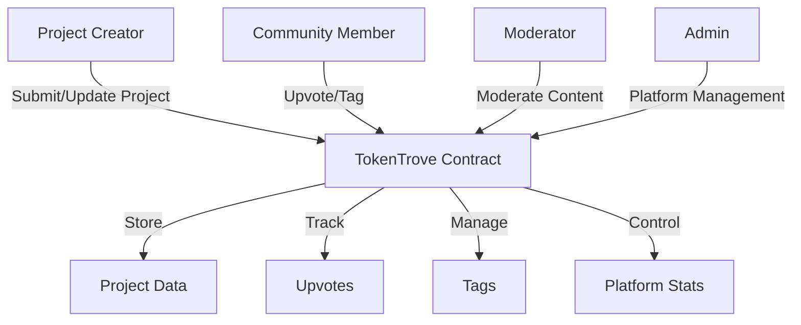

# Token Discovery Platform (TokenTrove)

A comprehensive discovery platform for finding, evaluating, and engaging with upcoming token and NFT projects on the Stacks blockchain.

## Overview

TokenTrove serves as a central hub where project creators can list their tokens/NFTs, and users can discover projects before they gain mainstream attention. The platform implements a community-driven curation mechanism through upvoting and tagging, ensuring quality projects rise to the top through merit rather than paid promotion.

### Key Features
- Project submission and management
- Community-driven curation through upvoting
- Tagging system for enhanced discoverability
- Moderation system for platform safety
- Time-decay voting mechanism
- Comprehensive project metadata storage

## Architecture

The platform is built around a single core smart contract that manages project listings, user interactions, and platform governance.



### Core Components
- Projects Map: Stores comprehensive project information
- Upvotes Map: Tracks user votes to prevent duplicates
- Tags System: Enhances project discoverability
- Moderation System: Ensures platform safety
- Statistics Tracking: Monitors platform metrics

## Contract Documentation

### Main Data Structures

#### Project Structure
```clarity
{
  creator: principal,
  name: string-ascii,
  description: string-utf8,
  project-type: uint,
  category: string-ascii,
  stage: uint,
  creation-time: uint,
  website-url: optional string-ascii,
  social-links: list string-ascii,
  contract-address: optional principal,
  upvote-count: uint,
  active: bool
}
```

### Project Stages
- Pre-Launch (u1)
- Early Access (u2)
- Public (u3)

### Project Types
- Token (u1)
- NFT (u2)

## Getting Started

### Prerequisites
- Clarinet
- Stacks wallet
- Node.js environment

### Basic Usage

1. Submit a new project:
```clarity
(contract-call? .token-trove submit-project 
  "Project Name"
  "Description"
  u1  ;; TOKEN type
  "DeFi"
  u1  ;; PRE-LAUNCH stage
  (some "https://example.com")
  (list "https://twitter.com/project")
  none
)
```

2. Upvote a project:
```clarity
(contract-call? .token-trove upvote-project u1)
```

## Function Reference

### Public Functions

#### Project Management
- `submit-project`: Create a new project listing
- `update-project`: Modify an existing project
- `upvote-project`: Vote for a project
- `add-project-tag`: Add a tag to a project
- `remove-project-tag`: Remove a tag from a project

#### Moderation
- `add-moderator`: Add a new moderator
- `remove-moderator`: Remove a moderator
- `ban-user`: Ban a user from the platform
- `unban-user`: Remove a user ban
- `moderate-project`: Activate/deactivate a project

#### Administration
- `transfer-admin`: Transfer admin rights
- `set-platform-active`: Enable/disable the platform

### Read-Only Functions
- `get-project`: Retrieve project details
- `get-user-vote`: Check if a user has voted
- `check-moderator`: Verify moderator status
- `get-platform-stat`: Get platform statistics
- `has-project-tag`: Check if a project has a specific tag

## Development

### Testing
1. Clone the repository
2. Install Clarinet
3. Run tests:
```bash
clarinet test
```

### Local Development
1. Start Clarinet console:
```bash
clarinet console
```
2. Deploy contract:
```clarity
(contract-call? .token-trove ...)
```

## Security Considerations

### Access Control
- Admin-only functions for platform management
- Moderator functions for content control
- Creator-only project updates
- One vote per user per project

### Platform Safety
- User banning system
- Project moderation capabilities
- Input validation for all functions
- Platform-wide activation control

### Limitations
- No vote delegation
- Simple time-decay mechanism
- Limited to Stacks blockchain projects
- Maximum 5 social links per project